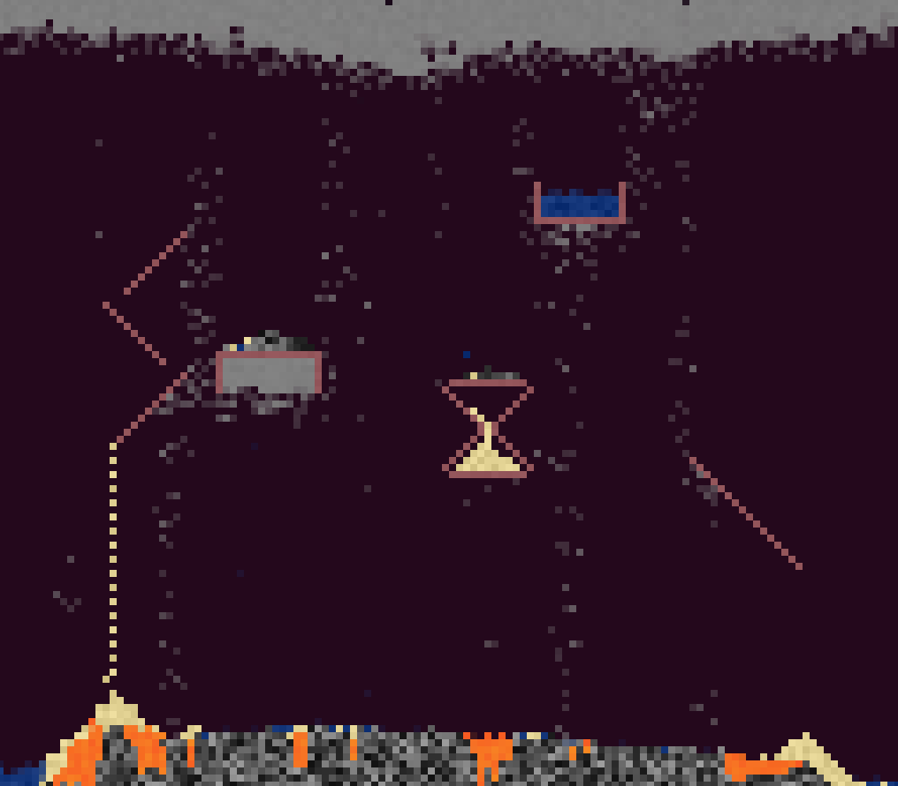

# dust-engine
A basic powder-game engine, supporting SDL2 rendering and modular definition of particle types. Also a prototype for the improved C++ engine I am working on.

Drawing heavy inspiration from Falling Everything, I intend to eventually add entities, rigid-body physics, and better fluids,
with the hopes of some day adding new features such as interacting layers, on-the-fly structure simulation, and directional
gravity
